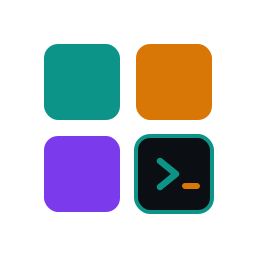
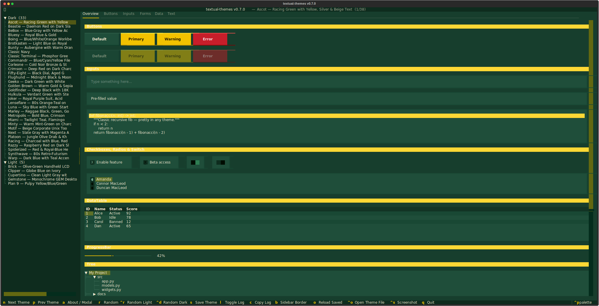
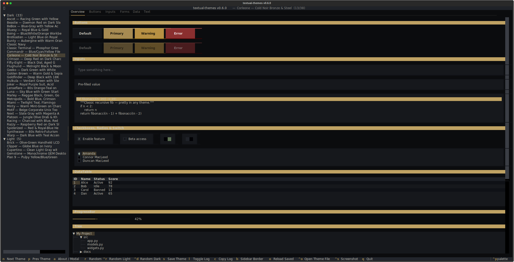
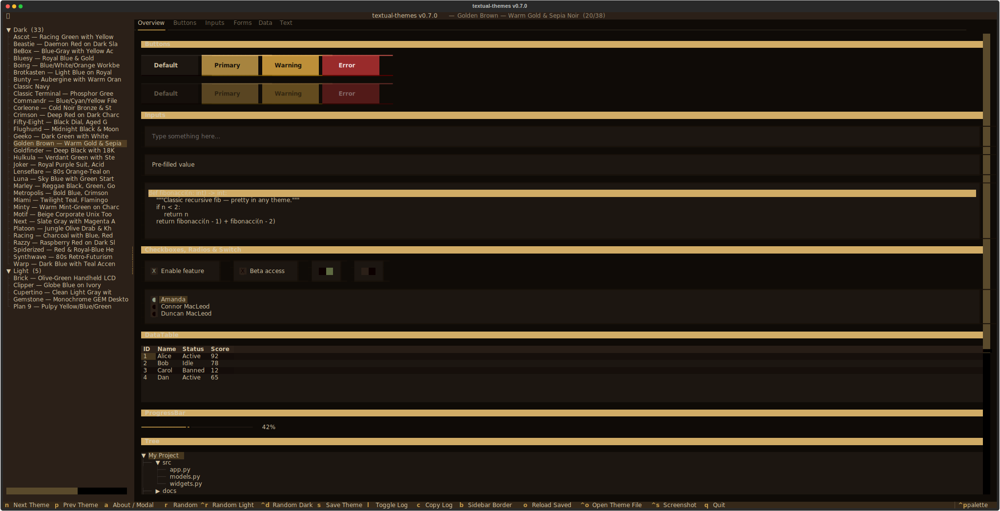
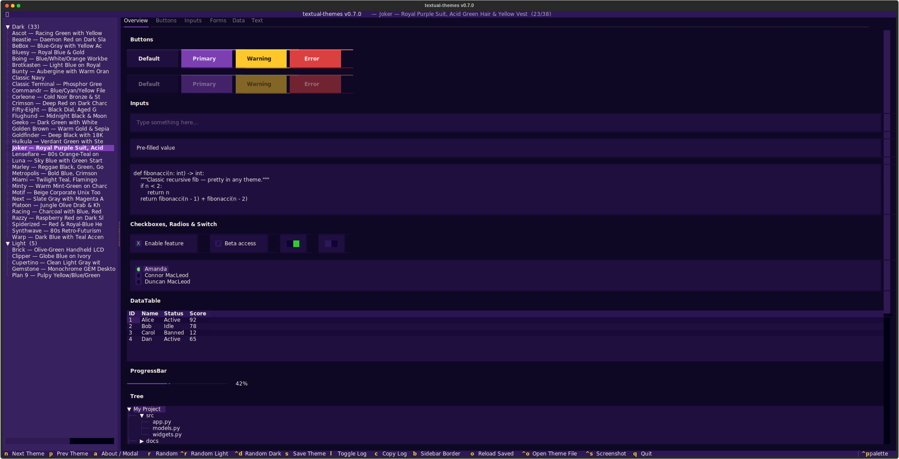
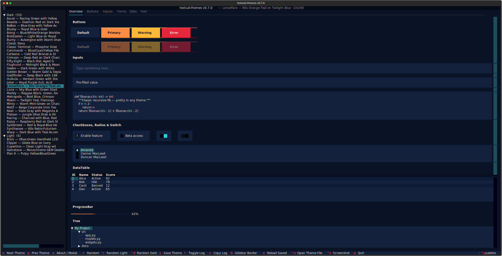
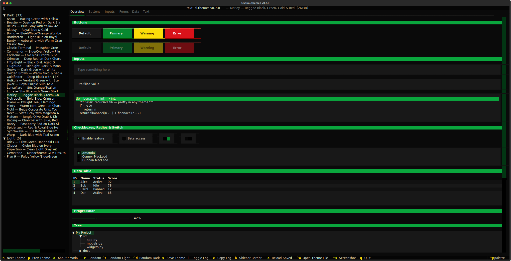
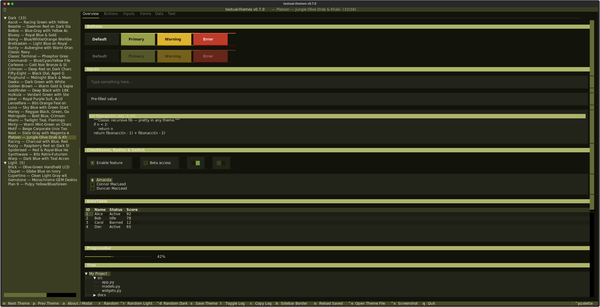

<p align="center">
  <picture>
    <source media="(prefers-color-scheme: dark)" srcset="docs/icon-dark.svg">
    
  </picture>
</p>

# textual-themes

<p align="center">
   <a href="README.md">English</a> ·
   <b>Deutsch</b>
</p>

---

[](https://github.com/michaelblaess/textual-themes/stargazers)
[](https://github.com/michaelblaess/textual-themes/network/members)
[](https://github.com/michaelblaess/textual-themes/issues)
[](https://github.com/michaelblaess/textual-themes/pulls)

[](https://github.com/michaelblaess/textual-themes/commits/main)
[](LICENSE)
[](https://www.python.org/)
[](#galerie)

Retro-Farbthemes fuer [Textual](https://textual.textualize.io/) TUI-Anwendungen.

38 sorgfaeltig gestaltete Themes, inspiriert von klassischen Computern, Betriebssystemen, historischen Taucheruhren, Comic-Farbschemata, 80er-Pastell, Spielberg-Aera-Kino, Motorsport-Lackierungen, Reggae-Roots und Mafia-Noir-Kino.

> **⚠ Markenrechtlicher Hinweis**
>
> Dies ist ein **unabhaengiges, von Fans erstelltes, nicht-kommerzielles**
> Projekt. Die Theme-Namen beschreiben ausschliesslich den visuellen Stil —
> es werden keine Marken Dritter als Theme-Namen verwendet. Jegliche
> verbleibende Markenbezugnahme im beschreibenden Text (z. B. "PETSCII style",
> "GEM Desktop", "Cinnamon-style") ist rein beschreibend und steht in keiner
> Verbindung zu den jeweiligen Markeninhabern, wird von ihnen weder
> unterstuetzt noch gesponsert noch lizenziert.

## Galerie

Klicke auf eine beliebige Miniatur, um die SVG-Datei in voller Groesse zu
oeffnen. Die Screenshots stammen aus der mitgelieferten Demo-App
(`python -m textual_themes`).

<table>
<tr>
<td align="center"><a href="docs/screenshots/ascot.svg"></a><br><sub><b>Ascot</b></sub></td>
<td align="center"><a href="docs/screenshots/beastie.svg"></a><br><sub><b>Beastie</b></sub></td>
<td align="center"><a href="docs/screenshots/bebox.svg"></a><br><sub><b>BeBox</b></sub></td>
<td align="center"><a href="docs/screenshots/bluesy.svg"></a><br><sub><b>Bluesy</b></sub></td>
</tr>
<tr>
<td align="center"><a href="docs/screenshots/boing.svg"></a><br><sub><b>Boing</b></sub></td>
<td align="center"><a href="docs/screenshots/brick.svg"></a><br><sub><b>Brick</b></sub></td>
<td align="center"><a href="docs/screenshots/brotkasten.svg"></a><br><sub><b>Brotkasten</b></sub></td>
<td align="center"><a href="docs/screenshots/bunty.svg"></a><br><sub><b>Bunty</b></sub></td>
</tr>
<tr>
<td align="center"><a href="docs/screenshots/classic-navy.svg"></a><br><sub><b>Classic Navy</b></sub></td>
<td align="center"><a href="docs/screenshots/classic-terminal.svg"></a><br><sub><b>Classic Terminal</b></sub></td>
<td align="center"><a href="docs/screenshots/clipper.svg"></a><br><sub><b>Clipper</b></sub></td>
<td align="center"><a href="docs/screenshots/commandr.svg"></a><br><sub><b>Commandr</b></sub></td>
</tr>
<tr>
<td align="center"><a href="docs/screenshots/corleone.svg"></a><br><sub><b>Corleone</b></sub></td>
<td align="center"><a href="docs/screenshots/crimson.svg"></a><br><sub><b>Crimson</b></sub></td>
<td align="center"><a href="docs/screenshots/cupertino.svg"></a><br><sub><b>Cupertino</b></sub></td>
<td align="center"><a href="docs/screenshots/fifty-eight.svg"></a><br><sub><b>Fifty-Eight</b></sub></td>
</tr>
<tr>
<td align="center"><a href="docs/screenshots/flughund.svg"></a><br><sub><b>Flughund</b></sub></td>
<td align="center"><a href="docs/screenshots/geeko.svg"></a><br><sub><b>Geeko</b></sub></td>
<td align="center"><a href="docs/screenshots/gemstone.svg"></a><br><sub><b>Gemstone</b></sub></td>
<td align="center"><a href="docs/screenshots/golden-brown.svg"></a><br><sub><b>Golden Brown</b></sub></td>
</tr>
<tr>
<td align="center"><a href="docs/screenshots/goldfinder.svg"></a><br><sub><b>Goldfinder</b></sub></td>
<td align="center"><a href="docs/screenshots/hulkula.svg"></a><br><sub><b>Hulkula</b></sub></td>
<td align="center"><a href="docs/screenshots/joker.svg"></a><br><sub><b>Joker</b></sub></td>
<td align="center"><a href="docs/screenshots/lenseflare.svg"></a><br><sub><b>Lenseflare</b></sub></td>
</tr>
<tr>
<td align="center"><a href="docs/screenshots/luna.svg"></a><br><sub><b>Luna</b></sub></td>
<td align="center"><a href="docs/screenshots/marley.svg"></a><br><sub><b>Marley</b></sub></td>
<td align="center"><a href="docs/screenshots/metropolis.svg"></a><br><sub><b>Metropolis</b></sub></td>
<td align="center"><a href="docs/screenshots/miami.svg"></a><br><sub><b>Miami</b></sub></td>
</tr>
<tr>
<td align="center"><a href="docs/screenshots/minty.svg"></a><br><sub><b>Minty</b></sub></td>
<td align="center"><a href="docs/screenshots/motif.svg"></a><br><sub><b>Motif</b></sub></td>
<td align="center"><a href="docs/screenshots/next.svg"></a><br><sub><b>Next</b></sub></td>
<td align="center"><a href="docs/screenshots/plan9.svg"></a><br><sub><b>Plan 9</b></sub></td>
</tr>
<tr>
<td align="center"><a href="docs/screenshots/platoon.svg"></a><br><sub><b>Platoon</b></sub></td>
<td align="center"><a href="docs/screenshots/racing.svg"></a><br><sub><b>Racing</b></sub></td>
<td align="center"><a href="docs/screenshots/razzy.svg"></a><br><sub><b>Razzy</b></sub></td>
<td align="center"><a href="docs/screenshots/spiderized.svg"></a><br><sub><b>Spiderized</b></sub></td>
</tr>
<tr>
<td align="center"><a href="docs/screenshots/synthwave.svg"></a><br><sub><b>Synthwave</b></sub></td>
<td align="center"><a href="docs/screenshots/warp.svg"></a><br><sub><b>Warp</b></sub></td>
</tr>
</table>

## Themes

### Dunkle Themes

| Theme | Stil |
|-------|------|
| **Ascot** | Le-Mans-Rennsportgruen mit Signalgelb, Silber und beigem Text |
| **Beastie** | Daemon-Rot auf dunklem Schiefer |
| **BeBox** | Blaugrau mit gelbem Statusleisten-Akzent |
| **Bluesy** | Koenigsblau mit kraeftigen gelb-goldenen Akzenten |
| **Boing** | Dreifarbige Workbench-Palette: Blau/Weiss/Orange |
| **Brotkasten** | Hellblau auf Koenigsblau, der ikonische 8-Bit-Farbeindruck (PETSCII) |
| **Bunty** | Aubergine mit warmen Orange-Akzenten |
| **Classic Navy** | Tiefes Marineblau mit Silber und gedaempftem Ziegelrot |
| **Classic Terminal** | Phosphorgruen auf Schwarz (CRT) |
| **Commandr** | Blau/Cyan/Gelb-Dateimanager-Palette |
| **Corleone** | Kuehles Mafia-Noir — Bronze, Stahlgrau und Asche auf blaeulichem Schwarz |
| **Crimson** | Tiefes Rot auf dunklem Anthrazit |
| **Fifty-Eight** | Schwarzes Zifferblatt mit gealtertem Gold-Leuchtstoff und rotem Lunette-Akzent (historische Taucheruhr) |
| **Flughund** | Mitternachtsschwarz und mondbeschienenes Blau |
| **Geeko** | Dunkelgruen mit Weiss |
| **Golden Brown** | Warmes Mafia-Noir — Antikgold, Sepia und Pergament auf warmem Schwarz |
| **Goldfinder** | Tiefes Schwarz mit 18-Karat-Gold-Akzenten — Schurken-Glamour |
| **Hulkula** | Leuchtend gruene Wut mit stahlgrauen Kanten |
| **Joker** | Comic-Gotham-Schurke — koenigsvioletter Anzug, saeuregruenes Haar, gelbe Weste |
| **Lenseflare** | 80er-Spielberg-Orange-Tuerkis bichromatisch auf Daemmerungsblau |
| **Luna** | Himmelblaue Taskleiste mit gruenem Start-Button |
| **Marley** | Reggae-Roots-Palette — Schwarz, Gruen, Gold und Rot |
| **Metropolis** | Kraeftige Primaer-Triade aus Blau, Karminrot und Sonnengelb |
| **Miami** | Pastell-80er — Daemmerungstuerkis, Flamingo-Pink, Sonnenuntergangs-Koralle |
| **Minty** | Warmes Minzgruen auf Anthrazit |
| **Motif** | Beige-schiefergraues Corporate-Unix-Toolkit |
| **Next** | Dunkelgrau mit Magenta-Akzenten — 3D-Abschraegungen der Workstation-Aera |
| **Platoon** | Gedaempftes militaerisches Olivgruen mit Khaki-Akzent auf Fast-Schwarz |
| **Racing** | Anthrazit mit tiefblauen, kirschroten und silbernen Streifen |
| **Razzy** | Himbeerrot auf dunklem Schiefer |
| **Spiderized** | Rot-koenigsblauer Helden-Anzug (hoher Kontrast) |
| **Synthwave** | Tiefes Violett mit Neon-Pink und elektrischem Cyan |
| **Warp** | Dunkelblau mit Tuerkis-Akzenten |

### Helle Themes

| Theme | Stil |
|-------|------|
| **Brick** | Olivgruenes Handheld-LCD auf beige-grauem Gehaeuse |
| **Clipper** | Globusblau auf Elfenbein — Jet-Age-Lackierung |
| **Cupertino** | Klares Hellgrau mit blauen Akzenten |
| **Gemstone** | Monochromer GEM-Desktop-Look |
| **Plan 9** | Knalliges Gelb/Blau/Gruen |

## Installation

Fuege die Themes zu deinem eigenen Textual-Projekt hinzu:

```bash
pip install git+https://github.com/michaelblaess/textual-themes.git
```

## Storybook

Durchstoebere alle 38 Themes interaktiv im mitgelieferten Storybook.
Installiere es mit einem einzigen Befehl — er richtet eine isolierte Umgebung
ein und fuegt einen `textual-themes-demo`-Launcher zu deinem PATH hinzu:

**Linux / macOS**

```bash
curl -fsSL https://raw.githubusercontent.com/michaelblaess/textual-themes/main/install.sh | bash
```

**Windows (PowerShell)**

```powershell
irm https://raw.githubusercontent.com/michaelblaess/textual-themes/main/install.ps1 | iex
```

Anschliessend startest du es:

```bash
textual-themes-demo
```

Erfordert Python 3.12+ und `git`. Um spaeter zu aktualisieren, fuehre einfach
den Installer erneut aus; zum Entfernen loeschst du `~/.textual-themes`
(Linux/macOS) oder `%LOCALAPPDATA%\textual-themes` (Windows) sowie den
`textual-themes-demo`-Launcher.

## Schnellstart

```python
from textual.app import App, ComposeResult
from textual.widgets import Header, Footer, Static

from textual_themes import register_all

class MyApp(App):
    BINDINGS = [("t", "next_theme", "Theme")]

    def __init__(self):
        super().__init__()
        register_all(self)
        self.theme = "brotkasten"

    def compose(self) -> ComposeResult:
        yield Header()
        yield Static("Hello from the past!")
        yield Footer()

    def action_next_theme(self):
        from textual_themes import RETRO_THEME_NAMES
        names = RETRO_THEME_NAMES
        idx = names.index(self.theme) if self.theme in names else -1
        self.theme = names[(idx + 1) % len(names)]

MyApp().run()
```

## Verwendung

### Alle Themes auf einmal registrieren

```python
from textual_themes import register_all

class MyApp(App):
    def __init__(self):
        super().__init__()
        register_all(self)       # registriert alle 38 Themes
        self.theme = "boing"     # eines auswaehlen
```

### Einzelne Themes registrieren

```python
from textual_themes import BROTKASTEN_THEME, CLASSIC_TERMINAL_THEME

class MyApp(App):
    def __init__(self):
        super().__init__()
        self.register_theme(BROTKASTEN_THEME)
        self.register_theme(CLASSIC_TERMINAL_THEME)
        self.theme = "classic-terminal"
```

### Verfuegbare Konstanten

```python
from textual_themes import (
    # Einzelne Theme-Objekte
    BROTKASTEN_THEME,
    BOING_THEME,
    GEMSTONE_THEME,
    CLASSIC_TERMINAL_THEME,
    NEXT_THEME,
    BEBOX_THEME,
    BUNTY_THEME,
    CUPERTINO_THEME,
    LUNA_THEME,
    COMMANDR_THEME,
    PLAN9_THEME,
    MOTIF_THEME,
    WARP_THEME,
    GEEKO_THEME,
    MINTY_THEME,
    CRIMSON_THEME,
    RAZZY_THEME,
    BEASTIE_THEME,
    FIFTY_EIGHT_THEME,
    BLUESY_THEME,
    GOLDFINDER_THEME,
    HULKULA_THEME,
    FLUGHUND_THEME,
    CLASSIC_NAVY_THEME,
    BRICK_THEME,
    CLIPPER_THEME,
    SYNTHWAVE_THEME,
    MIAMI_THEME,
    RACING_THEME,
    METROPOLIS_THEME,
    SPIDERIZED_THEME,

    # Sammlungen
    RETRO_THEMES,          # list[Theme] — alle 38 Themes
    RETRO_THEME_NAMES,     # list[str]   — ["brotkasten", "boing", ...]
    THEME_DISPLAY_NAMES,   # dict[str, str]

    # Hilfsfunktion
    register_all,          # register_all(app) — registriert alle Themes
)
```

### Theme-Namen

Verwende diese Slugs mit `app.theme = "..."`:

| Slug | Anzeige |
|------|---------|
| `brotkasten` | Brotkasten — Light Blue on Royal Blue |
| `boing` | Boing — Blue/White/Orange Workbench |
| `gemstone` | Gemstone — Monochrome GEM Desktop |
| `classic-terminal` | Classic Terminal — Phosphor Green on Black |
| `next` | Next — Slate Gray with Magenta Accents |
| `bebox` | BeBox — Blue-Gray with Yellow Accent |
| `bunty` | Bunty — Aubergine with Warm Orange Accents |
| `cupertino` | Cupertino — Clean Light Gray with Blue Accents |
| `luna` | Luna — Sky Blue with Green Start Accent |
| `commandr` | Commandr — Blue/Cyan/Yellow File Manager |
| `plan9` | Plan 9 — Pulpy Yellow/Blue/Green |
| `motif` | Motif — Beige Corporate Unix Toolkit |
| `warp` | Warp — Dark Blue with Teal Accents |
| `geeko` | Geeko — Dark Green with White |
| `minty` | Minty — Warm Mint-Green on Charcoal |
| `crimson` | Crimson — Deep Red on Dark Charcoal |
| `razzy` | Razzy — Raspberry Red on Dark Slate |
| `beastie` | Beastie — Daemon Red on Dark Slate |
| `fifty-eight` | Fifty-Eight — Black Dial, Aged Gold Lume & Bezel Red |
| `bluesy` | Bluesy — Royal Blue & Gold |
| `goldfinder` | Goldfinder — Deep Black with 18K Gold Accents |
| `hulkula` | Hulkula — Verdant Green with Steel Edges |
| `flughund` | Flughund — Midnight Black & Moonlit Blue |
| `classic-navy` | Classic Navy |
| `brick` | Brick — Olive-Green Handheld LCD |
| `clipper` | Clipper — Globe Blue on Ivory |
| `synthwave` | Synthwave — 80s Retro-Futurism |
| `miami` | Miami — Twilight Teal, Flamingo Pink & Sunset Coral |
| `racing` | Racing — Charcoal with Blue, Red & Silver Stripes |
| `metropolis` | Metropolis — Bold Blue, Crimson & Sun Yellow |
| `spiderized` | Spiderized — Red & Royal-Blue Hero Suit |

## Voraussetzungen

- Python >= 3.12
- Textual >= 0.85

## Themes bearbeiten

Um ein bestehendes Theme anzupassen oder ein neues interaktiv zu gestalten,
probiere [textual-theme-editor](https://github.com/TomJGooding/textual-theme-editor)
von Tom J Gooding — einen eigenstaendigen visuellen Theme-Editor fuer Textual.
Installiere ihn separat (`pip install textual-theme-editor`); er steht unter
der GPLv3-Lizenz und ist keine Abhaengigkeit dieses Pakets.

## Lizenz

Apache License 2.0 — siehe [LICENSE](LICENSE).
